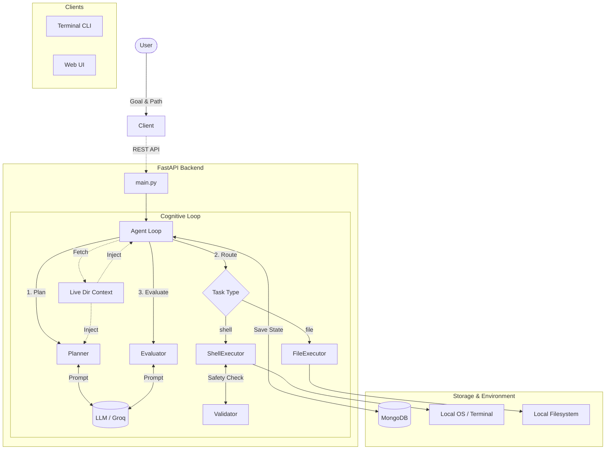

# NOMAD-1 System Design

Here is the visual architecture of the agent we built!

```mermaid
graph TD
    User([User]) -->|Goal & Path| Client
    
    subgraph Clients
        CLI[Terminal CLI]
        Web[Web UI]
    end
    
    Client -.->|REST API| FastAPI
    
    subgraph Server [FastAPI Backend]
        FastAPI[main.py] --> Loop[Agent Loop]
        
        subgraph Cognitive Loop
            Loop -->|1. Plan| Planner
            Planner <-->|Prompt| Brain[(LLM / Groq)]
            Loop -->|2. Route| Router{Task Type}
            
            Router -->|shell| ShellExecutor
            Router -->|file| FileExecutor
            
            ShellExecutor <-->|Safety Check| Validator
            
            Loop -->|3. Evaluate| Evaluator
            Evaluator <-->|Prompt| Brain
            
            Loop -.->|Fetch| DirContext[Live Dir Context]
            DirContext -.->|Inject| Planner
            DirContext -.->|Inject| Loop
        end
    end
    
    subgraph Storage & Environment
        Loop <-->|Save State| Mongo[(MongoDB)]
        ShellExecutor --> OS[Local OS / Terminal]
        FileExecutor --> FS[Local Filesystem]
    end
```
